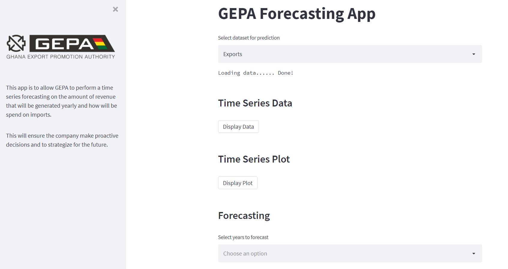

# Export and Import Price Prediction

The goal of this demo is to help companies that deal in imports and exports of goods and services to be able to forecast export revenue and also forecast amount spent on imports. It will also help organizations determine trends and seasonalities in their daily transactions.

This is achieved by building a model to perform the forecasting and also perform time series analysis of the organizations time series data. This app allows users to be able to train, predict and visualize the performance of the model.

## Product SnapShot

## How to Reproduce - local
1. Download repository
2. Unzip
3. Go to the directory
4. Install the dependencies using: pip3 install -r requirments.text
5. Run the application: streamlit run app.py

## App Link
[GEPA Time Series Forecaster](https://share.streamlit.io/adark-amal/gepa-time-series-demo/main/app.py)

## License
MIT
